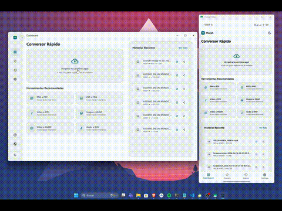

# 🚀 Morph — Conversor Multimedia Premium & Multiplataforma

[](https://flutter.dev)
[](https://dart.dev)
[](#)
[](LICENSE)

**Morph** es una herramienta rápida, privada y multiplataforma diseñada para la conversión local de archivos multimedia (imágenes, video y audio). Construida con **Flutter** y potenciada por el motor de **FFmpeg Kit**, Morph destaca por su interfaz minimalista de primer nivel, animaciones fluidas y una experiencia de usuario sumamente pulida tanto en escritorio como en dispositivos móviles.

---

<div align="center">
  
</div>

---

## ✨ Características Principales

*   **🎨 Diseño Premium & Glassmorphic**: Interfaz ultra-moderna de alto impacto visual inspirada en las últimas tendencias de UI/UX, optimizada de forma responsiva para Escritorio (diseño de 3 columnas), Tablet y Móviles.
*   **🔄 Conversiones Multimedia Locales**:
    *   **Imágenes**: Soporta `PNG`, `JPG`, `JPEG`, `WEBP`, `GIF`, y generación de `PDF`.
    *   **Video**: Soporta `MP4`, `WEBM`, `MKV`, `AVI`, `MOV`, `FLV`, y `WMV`.
    *   **Audio**: Soporta `MP3`, `WAV`, `OGG`, `M4A`, `FLAC`, y `AAC`.
*   **🧬 Transiciones de Tema Circulares (Estilo Telegram)**:
    *   Cambia instantáneamente entre el **Modo Claro** y **Modo Oscuro** con una espectacular animación de revelado circular que se origina desde el punto exacto donde hiciste clic.
    *   Soporte para **Colores de Acento Personalizables** (Índigo, Teal, Forest Green, Orange, Purple, Rose) con el mismo efecto de onda circular interactiva.
*   **📄 Fusión de PDFs en Segundo Plano (Isolates)**:
    *   Combina múltiples imágenes en un único documento PDF multipágina.
    *   Todo el procesamiento pesado de codificación de imágenes y guardado de PDF se ejecuta en un **Isolate de Dart** (hilo de fondo) independiente para asegurar que la interfaz del usuario permanezca a **60 FPS constantes** sin congelamientos.
*   **📦 Conversión por Lotes & Empaquetado ZIP**:
    *   Permite añadir múltiples archivos a la cola de procesamiento mediante arrastrar y soltar (**Drag & Drop**).
    *   Personalización de formatos de salida de forma individual o grupal.
    *   Opción de empaquetar automáticamente todos los archivos convertidos en un único archivo `.zip` al finalizar.
*   **🔌 Integración Nativa con Windows**:
    *   Añade la opción **"Convertir con Morph"** directamente al menú contextual (clic derecho) del Explorador de Windows mediante un registro dinámico en el sistema.
*   **🔍 Historial Inteligente & Acciones Rápidas**:
    *   Registra localmente tus conversiones pasadas.
    *   Buscador interactivo en tiempo real y filtros por categorías de archivos (Chips).
    *   Acciones directas para **Abrir Archivo** en el sistema o **Compartir** a través de la hoja de compartición nativa de tu dispositivo móvil.

---

## 🛠️ Tecnologías y Librerías Utilizadas

*   **Flutter SDK**: Framework UI multiplataforma de Google.
*   **FFmpeg Kit (`ffmpeg_kit_flutter_new_full`)**: Motor de procesamiento multimedia nativo y ultra-rápido ejecutado localmente.
*   **Flutter BLoC (`flutter_bloc`)**: Gestión de estados reactivos siguiendo buenas prácticas de separación de conceptos.
*   **GoRouter**: Enrutador declarativo para una navegación fluida y consistente en todas las plataformas.
*   **Animated Theme Switcher (`animated_theme_switcher`)**: Animaciones fluidas de máscara circular para cambios de tema en vivo.
*   **Share Plus (`share_plus`)**: Compartición nativa multiplataforma de archivos.
*   **GetIt**: Contenedor de Inyección de Dependencias (Service Locator) para desacoplamiento de servicios.

---

## 📂 Estructura del Proyecto

El código sigue los principios de **Clean Architecture** estructurado por capas y características:

```
lib/
├── core/
│   ├── di/             # Inyección de dependencias (GetIt)
│   ├── navigation/     # Configuración de rutas (GoRouter)
│   └── theme/          # Sistema de diseño, paleta de colores y tokens de UI
├── features/
│   ├── converter/      # Lógica del conversor (Cola de archivos, Isolates, PDF, FFMpeg)
│   ├── dashboard/      # Panel de inicio rápido, recomendación de herramientas y estadísticas
│   ├── history/        # Historial de conversiones persistido localmente con filtros
│   ├── settings/       # Ajustes globales del sistema (Tema, Color, Localización)
│   └── shell/          # Contenedor responsivo principal (Sidebar y Bottom Bar)
├── l10n/               # Internacionalización y archivos de traducción (ARB)
└── services/           # Servicios globales (Notificaciones, Registro de Windows, etc.)
```

---

## 🚀 Empezando

### Requisitos Previos

*   Flutter SDK instalado (Versión `>= 3.12.2`).
*   Configuración de herramientas de compilación para la plataforma destino (Visual Studio para Windows, Xcode para macOS/iOS, SDK de Android para Android).

### Instalación y Ejecución

1.  Clona este repositorio en tu máquina local.
2.  Obtén las dependencias del proyecto:
    ```bash
    flutter pub get
    ```
3.  Genera las traducciones localizadas automáticas:
    ```bash
    flutter gen-l10n
    ```
4.  Ejecuta la aplicación en modo desarrollo en la plataforma elegida (por ejemplo, Windows):
    ```bash
    flutter run -d windows
    ```

### Compilar para Producción

*   **Windows (Generar ejecutable portable)**:
    ```bash
    flutter build windows --release
    ```
*   **Android (Generar APK)**:
    ```bash
    flutter build apk --release
    ```

---

## 🤝 Contribuciones y Comunidad

¡Las contribuciones son lo que hace a la comunidad de código abierto un lugar increíble para aprender, inspirar y crear! Si eres desarrollador y quieres ayudar a mejorar Morph:

1.  Haz un **Fork** del proyecto.
2.  Crea una rama para tu funcionalidad o corrección (`git checkout -b feature/nueva-mejora`).
3.  Realiza tus cambios y haz un commit limpio (`git commit -m 'Añade nueva mejora'`).
4.  Sube la rama a tu fork (`git push origin feature/nueva-mejora`).
5.  Abre un **Pull Request** detallando tus cambios.

Cosas en las que puedes colaborar:
*   Optimización de comandos FFmpeg para conversiones aún más rápidas.
*   Integración de nuevos formatos multimedia en las colas.
*   Refinamiento del diseño responsivo e interacciones de UI/UX.
*   Localización y traducciones a nuevos idiomas.

---

## 📧 Soporte y Contacto

Si tienes alguna pregunta, encuentras algún fallo o deseas sugerir una nueva funcionalidad, puedes ponerte en contacto a través de:

*   **📧 Correo de Soporte**: [soporte@aescalante.dev](mailto:soporte@aescalante.dev)
*   **🌐 Sitio Web Oficial**: [www.aescalante.dev](https://www.aescalante.dev/)

---

## 📄 Licencia

Este proyecto está bajo la **Licencia MIT**. Siéntete libre de usarlo, modificarlo y distribuirlo comercial o personalmente. Para más detalles, consulta el archivo [LICENSE](LICENSE).

---

*Desarrollado con ❤️ y código limpio por [aescalante.dev](https://www.aescalante.dev/).*
